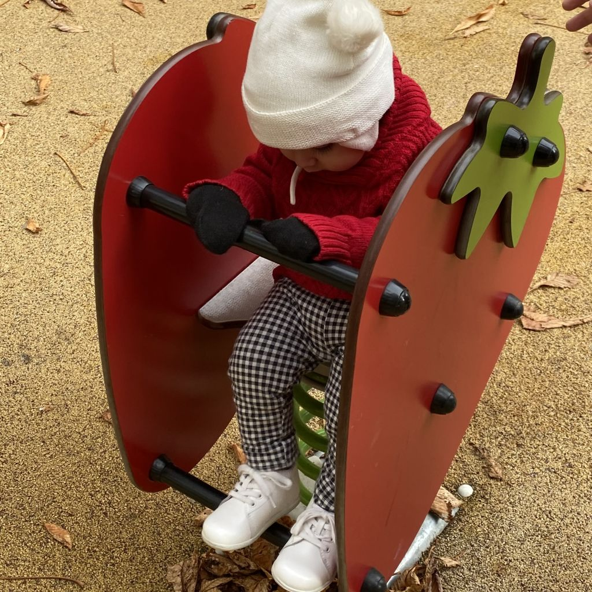
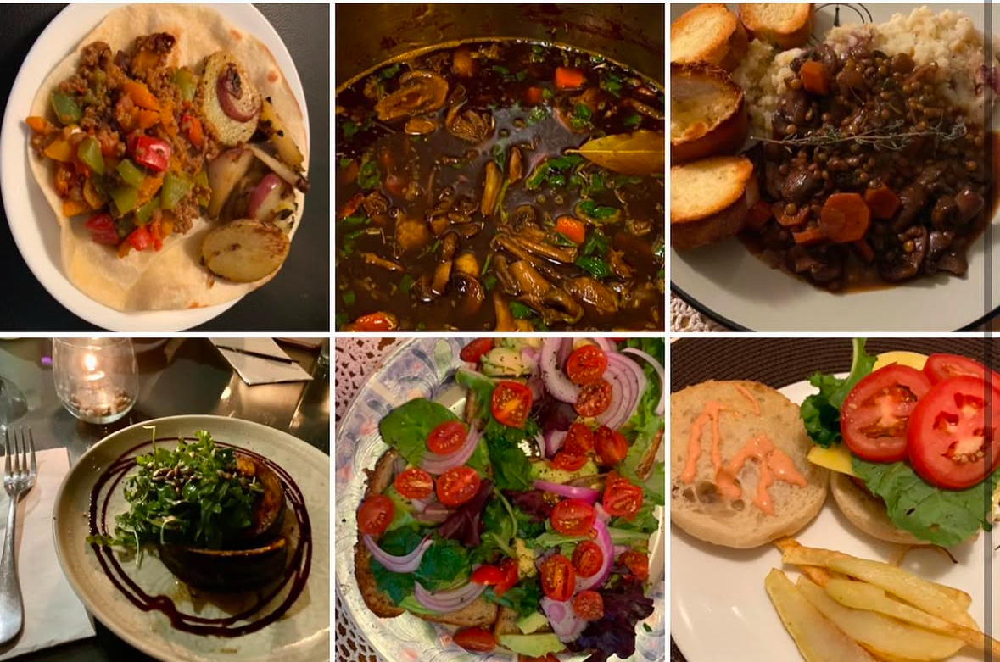
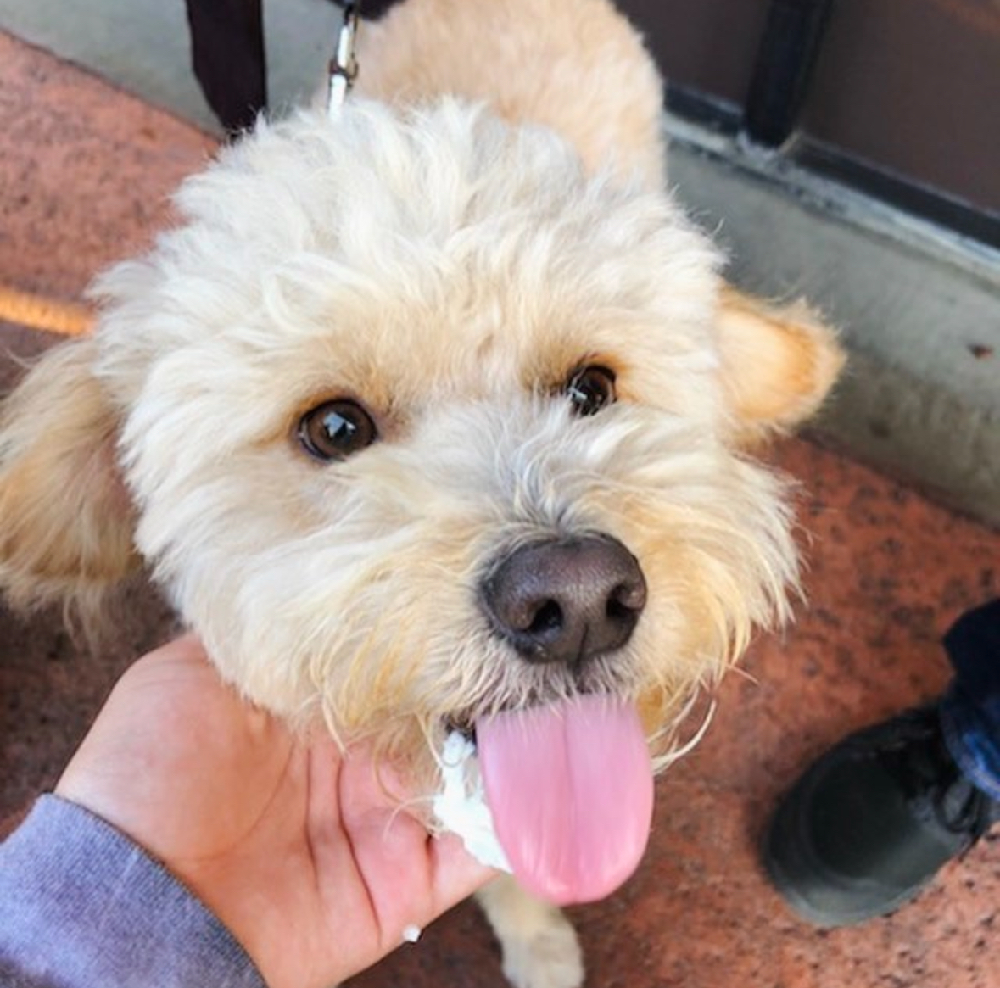

##  Quick glimpse
Hi again!

 **For those who are just browsing**:
 
 I enjoy trying new vegan dishes, whether that's at home or at a restaurant, traveling around the world, and spending time with my pet companion, Raaja, who likes to smell flowers on his daily walks.

My favorite genre for reading is classic literature and if possible, I prefer to read in the original language.

I also play video games from animal crossing to call of duty. Since my screentime would be doubled from gaming and classwork, I have transitioned to playing sudoku from a book, card games, and now outdoor sports.

The way I connect with nature is by enjoying the beach at night, especially during a full moon.


##  My Adventures around the world

The coolest thing to me when I was a kid was the idea of seeing the entire world, which is something I wanted to have my own child experience along with me. My family have origins from multiple parts of the world, including Mexico, South Korea, Portugal, and Spain.

My bucket list of places to visit has grown larger and larger as time goes on, but there are two places that are dear to me that take precedence. One is the birth place of my mom which is Jalisco, Mexico and the other is Seoul, South Korea where my paternal grandmother originates, though she was also born in Yucatan, Mexico.

:::{.column-margin}
```{r}
#| echo: false
#| fig-align: left
#| fig-alt: "France Trip 2022"

```
::: {.center-text .extra-small-text .dark-gray-text .topbr}
*France Trip 2022.*
:::
:::

My favorite traveling memory is taking my 1 year old son to Europe and having him tag along everywhere we went like a 15 pound backpack! We stayed in Lyon, France and visited Paris as well as Geneva, Switzerland. His first playground he played on was a french playground and they really set the standard for playgrounds after that. Even more recently, we visited Tulum, Mexico where we spent all day at the pool or at the beach. And of course, no matter the location, my favorite thing to do is eat the local vegan food.


##  My Vegan Lifestyle



I wasn't born into a vegan life; I adopted one. I have always had a great interest in reducing my meat intake, cutting out dairy for health reasons, and just not harming animals in general, but never took the plunge until 2022.

People may think it's just changing the diet, but it's other things too like not buying fur, wool, or leather. My vegan lifestyle blends very well with my academic interests and I have had the chance to explore environmental veganism due to my major. There are many challenges that come with being vegan as the food may not be so easily accessible such as animal-based food, but with time and experience those challenges have become minimal. There are so many great dishes that have found their way into rotation. Currently, there's a tuscan gnoochi dish that is comforting, filling, and delicious, but the best part is that it's incredibly fast!
 
**My favorite recipes are**:

- [Tofu pudding](https://www.hummusapien.com/tofu-chocolate-pudding/){target="_blank"}
- [Zucchini roll ups](https://frommybowl.com/vegan-zucchini-lasagna-roll-ups/){target="_blank"}

**Favorite places to eat**:

- OBerny Lyon, France
- Pots and Wok Whittier, California
- Just What I kneaded Los Angeles, California
- El Bajon Vegan Tacos Tulum, Mexico
- Noodle City Goleta, California
- Garden Fresh Hacienda Heights, California
- My mom's house Home, Earth


##  Meet Raaja

{width="500px"}

A dog is like having a guardian angel on Earth!

Raaja is my 10 year old dog, who was rescued from SEACCA, and intially just a small golden puppy at four months old when we first met in 2015. Ever since then, he has always been by my side going everywhere with me. His favorite thing to do is meet people, escape the house, and return months later. Thankfully, as he ages his attempts decrease and when he does excape he'll just go scratch the front door and if it goes ignored, he'll do a very pronounce bark as if annoyed. He's great! ◡̈

Check out his [instagram](https://www.instagram.com/raajatheprince/){target="_blank"}!

